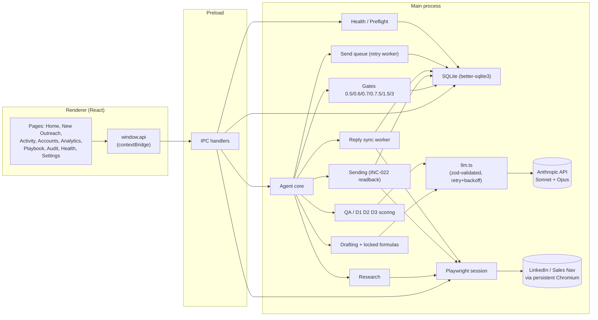
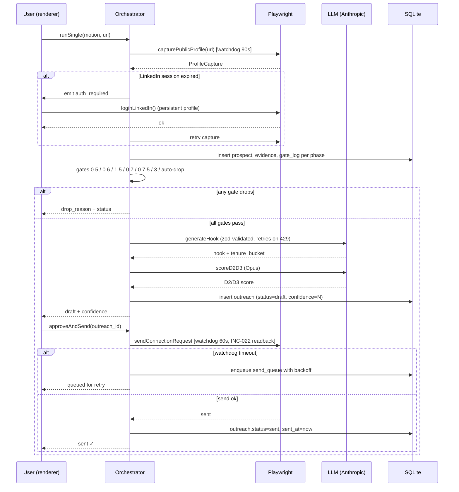
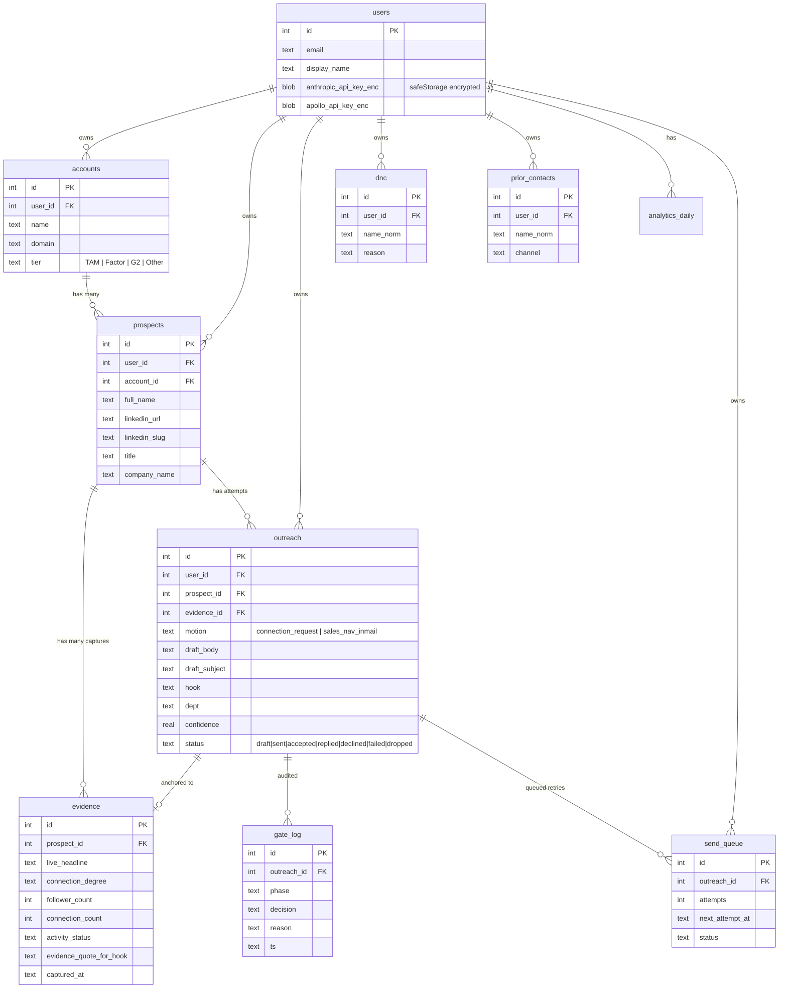

# LinkedIn Copilot

Desktop app for Testsigma BDRs/AEs that handles the front-end of LinkedIn outreach end-to-end: prospecting from TAM, research, drafting against locked formulas, QA scoring, and Playwright-driven send. Each prospect goes from URL to a sent invitation in under 5 minutes, gated at a 9.0/10 confidence floor.

## Status

MVP — single-user (Rob), connection-request hero flow + Sales Nav InMail second flow. Built on top of the BDR repo's `linkedin-connection-batch` v2 skill (locked Apr 30, 2026). Multi-user-ready data model.

See `CHANGELOG.md` for what shipped each day, `HANDOFF.md` for next-agent onboarding, `SKILL_GAPS.md` for ported-vs-pending against the BDR canonical skill.

## Stack

- Electron 33 + Vite + TypeScript
- React 18 + Tailwind (dark theme)
- Playwright (Node) with persistent Chromium profile, separate from your daily Chrome
- better-sqlite3 for local-first storage with versioned migrations
- Anthropic SDK (`@anthropic-ai/sdk`) — Sonnet 4.6 for hooks, Opus 4.7 for QA scoring; graceful heuristic fallback when no key
- zod for runtime LLM-response validation
- Vitest + GitHub Actions CI

## Running

```bash
npm install
npm run dev
```

First launch opens the onboarding overlay: sign into LinkedIn + Sales Nav once in the embedded browser, drop in your Anthropic / Apollo keys (optional), import your TAM CSV.

```bash
npm run typecheck    # silent on success
npm run test         # 50 Vitest tests
npm run smoke        # 22-check CLI validation
npm run lint         # ESLint
npm run format       # Prettier
npm run build        # production build
npm run package      # electron-builder --dir (unpacked app)
npm run dist         # electron-builder (full installer)
```

## Architecture



### Data flow for a single prospect



## Database schema



## Project layout

```
src/
  main/                       Electron main process
    db/
      schema.sql              Snapshot of current schema (canonical: migrations/)
      migrations/             Versioned migrations (PRAGMA user_version)
      client.ts               Connection management
      seed.ts                 First-run seeding from data/seed/
      backup.ts               Online backup + restore
      migrate.ts              Migration runner
    browser/
      session.ts              Persistent Playwright Chromium profile
      linkedin.ts             LinkedIn selectors + INC-022 readback send
      watchdog.ts             Timeout wrapper for Playwright calls
    agent/
      orchestrator.ts         Pipeline: research → gates → drafting → QA
      gates.ts                Phase 0.5/0.6/0.7/0.7.5/1.5/3 + auto-drop
      research.ts             Profile capture + auto-drop signal detection
      drafting.ts             Connection-request locked formula + LLM hook
      inmail.ts               Sales Nav InMail 5-paragraph hero formula
      qa.ts                   D1 deterministic + D2/D3 LLM scoring
      llm.ts                  Anthropic SDK with zod validation + 429 backoff
      sending.ts              approveAndSend with watchdog + auto-enqueue
      sendQueue.ts            Persistent retry queue with backoff worker
      sync.ts                 Reply-sync background worker
      analytics.ts            Rollup queries + Today's Actions
      demo-seeds.ts           3 pre-baked prospects for rehearsal
    health/
      preflight.ts            12 startup self-tests
      logTail.ts              Reads electron-log main.log
      playwrightInstall.ts    npx playwright install chromium runner
    ipc/handlers.ts           All IPC routes
    secrets.ts                safeStorage encrypt/decrypt for API keys
    runtime-state.ts          In-memory LinkedIn session state
    index.ts                  Electron entry
  preload/index.ts            contextBridge — typed window.api
  renderer/
    App.tsx                   Sidebar shell + view router + global shortcuts
    components/
      HeaderBanner            LinkedIn / Anthropic / Apollo / Sends-today pills
      Toast                   Notification system
      Onboarding              First-run overlay
      Shortcuts               Cmd+/ overlay
      CommandPalette          Cmd+K fuzzy search
      PipelineProgress        Vertical stepper visualization
      ErrorBoundary           Per-page render-error recovery
    pages/
      Home                    Today's Actions stack
      NewOutreach             6-step wizard (single + bulk modes)
      Activity                Searchable filterable table
      OutreachDetail          Per-prospect drill-down
      Accounts                ABM-style per-account view
      Analytics               Accept/reply rate, drop reasons, trends
      Playbook                BDR skills + locked formulas viewer
      Audit                   Gate-decision log viewer
      Health                  Preflight + log tail
      Settings                Keys, LinkedIn login, TAM, demo seeds, backups
  shared/types.ts             Cross-process IPC contract
data/
  seed/                       Bundled seed (TAM, DNC, MASTER_SENT_LIST, skills, playbooks, templates)
  userdata/                   Per-user runtime (gitignored)
tests/                        Vitest suites
scripts/                      smoke.mjs, extract-dnc.mjs
.github/workflows/ci.yml      typecheck + test + build on push
.husky/pre-commit             lint-staged
```

## BDR repo lineage

This app ports — does NOT replace — the following BDR assets. The BDR repo is the canonical source of truth; this app re-syncs on demand via `Settings → Re-import TAM` or by re-running `scripts/extract-dnc.mjs`.

- `tam-accounts-mar26.csv` → `data/seed/tam.csv`
- `MASTER_SENT_LIST.csv` → `data/seed/master_sent_list.csv`
- `skills/linkedin-connection-batch/SKILL.md` v2 → `data/seed/skills/linkedin-connection-batch.md`
- `skills/linkedin-connect/SKILL.md` v1.2 → `data/seed/skills/linkedin-connect.md`
- `memory/playbooks/linkedin-batch-quality-gate.md` → `data/seed/playbooks/`
- `memory/playbooks/linkedin-send-preflight.md` → `data/seed/playbooks/`
- DNC list from `CLAUDE.md` → `data/seed/dnc.json` (extracted by `scripts/extract-dnc.mjs`)
- Locked connection-request formula (INC-022) — encoded in `src/main/agent/drafting.ts`
- Locked InMail 5-paragraph formula — encoded in `src/main/agent/inmail.ts`

The BDR repo is read-only for this project.

## Reliability

- **Preflight** runs 12 checks at startup + every 15s on the Health page (Cmd+8): schema version, DB writable, integrity_check, seed counts, Playwright Chromium binary, LinkedIn session, API keys, encryption availability, INC-028 throttle, drop rate.
- **Watchdog** wraps every Playwright call with a hard timeout (90s capture, 60s connect-send, 90s InMail-send).
- **Send queue** persists watchdog-timed-out sends and retries with exponential backoff (1m, 5m, 15m, 60m, 240m).
- **LinkedIn session-expiry** auto-detected mid-pipeline; renderer auto-prompts re-login; orchestrator resumes the in-flight run.
- **Anthropic 429 / 5xx** retried with exponential backoff (1s, 2s, 4s, 8s); status surfaced into the wizard event log.
- **LLM responses** zod-validated; on parse failure, one retry with a stricter system prompt, then heuristic fallback.
- **Schema migrations** versioned via `PRAGMA user_version`; existing installs upgrade cleanly on app update.
- **Backups** created on demand from Settings; auto-pruned to last 20; restore via UI.
- **API keys** encrypted at rest via Electron `safeStorage` (OS keychain backed) when available.
- **Error boundaries** per page so a render bug in one view doesn't blank the whole app.

## Keyboard shortcuts

| Keys | Action |
| --- | --- |
| `Cmd+K` | Command palette (fuzzy search prospects, accounts, actions) |
| `Cmd+1`–`Cmd+9` | Switch tabs |
| `Cmd+N` | New outreach |
| `Cmd+/` | Shortcuts overlay |
| `Esc` | Close detail / overlays |
